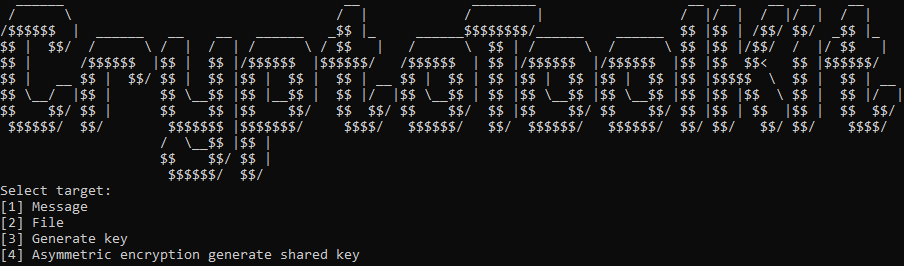

# CryptoToolKit
ToolKit for crypt/decrypt messages, files and generate random keys for crypt. You can use any data and password for crypt it and keep it safe



* tested on C++ 13

> [!NOTE]
> Using Alfa or beta CryptoToolKit is unsecure! This is test alfa release for developers. Use last release!

BitCoin DONATION ☕️: ```bc1q24sqqj6p6htuktap2vht2uzna9u7w3wlk8kfwk```

Monero DONATION ☕️: ```86FBJmZrMPcQvNQJ7fJ1Khg9Z1YMUBE2N6jzPiUbLtaKWQD1sTHbcB5JmCmxmNDkKXXQkic5pezv5hR6BLTvrSvvK7wA5LR```
